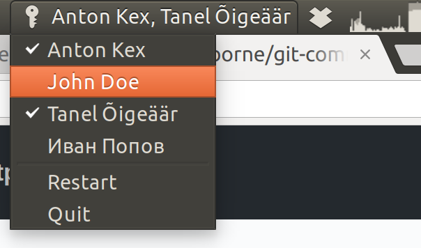

Git Committers Indicator
========================

This is a panel indicator for Linux/Ubuntu that aids pair programming with Git.

It allows you to easily select multiple committer names when there are several
developers sharing the same machine and writing code together.



After midnight, the indicator resets git comitters, so that you won't forget
to set new names in the morning when you switch pairs.

Specify names and emails of your team's developers in `developers.txt`, then
run `./indicator.sh`. Or add `indicator.sh` to Startup Applications.

Installation
========================

```
sudo apt install python3-gi libayatana-appindicator3-1 libayatana-appindicator3-dev gir1.2-ayatanaappindicator3-0.1
```
